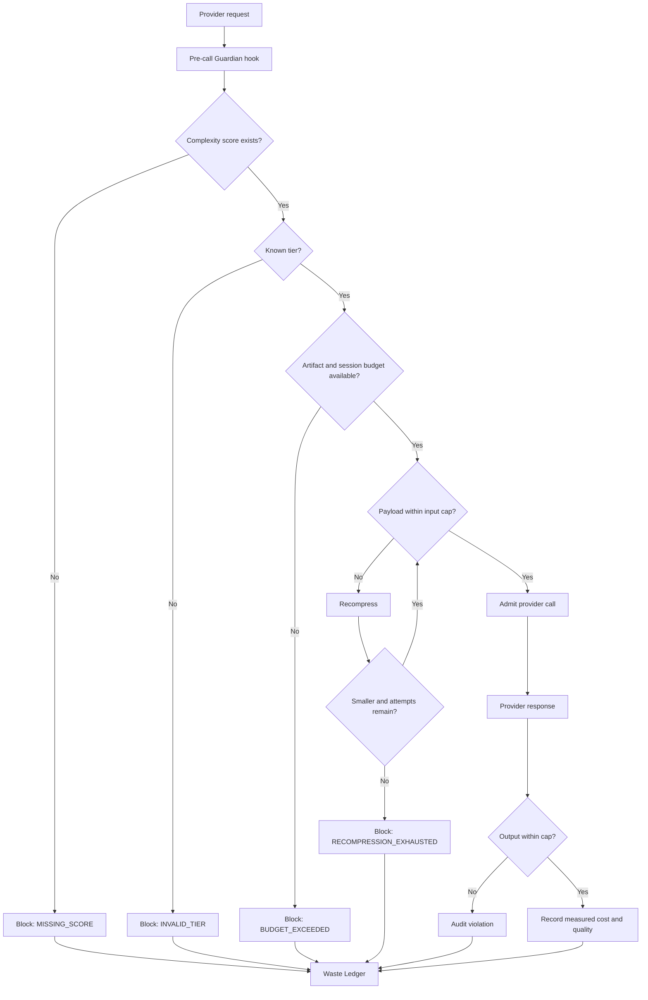

# agent-finops-ZWCA

> **Zero-Waste Context Architecture (ZWCA) Runtime** — deterministic admission, context compression, model routing, token-budget enforcement and auditable Agent FinOps.

`agent-finops` is a local-first runtime for controlling the cost, context and production readiness of AI agents. It unifies FinOps, context engineering, deterministic harnesses and runtime governance under one operating architecture.

> Every candidate token must pass three gates: **Admission** — does it deserve to enter? **Compression** — can it be smaller? **Audit** — did it generate accepted value?

ZWCA does not promise zero token usage. It targets **zero unjustified or unaccounted token consumption**.

## Four planes

```text
┌──────────────────────────────────────────────────────────────┐
│  PLANE 4 — GOVERNANCE & OBSERVABILITY                       │
│  Budget enforcement · Waste Ledger · Drift alerts · FinOps  │
├──────────────────────────────────────────────────────────────┤
│  PLANE 3 — DECISION                                          │
│  Complexity score · Thermal tier · Model routing · Approval  │
├──────────────────────────────────────────────────────────────┤
│  PLANE 2 — CONTEXT                                           │
│  AST admission · CCE retrieval · Graph context · Headroom    │
├──────────────────────────────────────────────────────────────┤
│  PLANE 1 — DETERMINISTIC FLOOR                               │
│  Everything that does not require an LLM executes here       │
└──────────────────────────────────────────────────────────────┘
```

## Runtime contract

1. **Deterministic before probabilistic.**
2. **No score, no call.**
3. **Minimum sufficient context.**
4. **Hard caps before provider calls.**
5. **No unlimited retries or automatic frontier escalation.**
6. **Quality and cost are evaluated together.**
7. **Measured, estimated and counterfactual evidence never mix.**
8. **Every admitted token has an auditable purpose and outcome.**

## Thermal Gradient × RTK tiers

| Tier | Score | Execution policy |
|---|---:|---|
| **Solar** | 0–15 | Deterministic, zero-token execution |
| **Daylight** | 16–30 | Small model, tightly constrained context |
| **Horizon** | 31–45 | Small or medium model |
| **Twilight** | 46–60 | Reasoning-capable model |
| **Starlight** | 61–80 | Advanced reasoning with approval controls |
| **Aurora** | 81–100 | Frontier model, maximum budget, mandatory approval |

The canonical policy is defined in [`config/zwca-dispatch.yaml`](config/zwca-dispatch.yaml).

## Guardian Enforcement Vertical

The Guardian slice moves ZWCA from architecture contracts into active runtime enforcement.

### Implemented

- SQLite migration for `zwca_sessions` and `waste_ledger_events`;
- mandatory pre-call interception;
- `no score, no call` enforcement;
- tier input and output hard caps;
- artifact and session budget evaluation;
- bounded recompression loop;
- fail-closed behavior when recompression makes no progress;
- admission, compression and audit event emission;
- measured completion cost persisted into session and artifact spend;
- automated tests for the main allow/block paths.

### Runtime flow



## Repository anatomy

```text
agent-finops/
├── runtime/
│   └── guardian.py              # enforcement engine
├── hooks/
│   └── pre_call_guardian.py     # stdin/stdout provider-call interceptor
├── store/
│   ├── waste_ledger.py          # persistence repository
│   └── migrations/
│       └── 002_waste_ledger.sql
├── config/
│   └── zwca-dispatch.yaml       # Thermal Gradient × RTK policy
├── schemas/
│   └── waste-ledger.schema.json
├── scripts/
│   ├── zwca_score.py
│   ├── cost_report.py
│   ├── rightsizing.py
│   └── gate.py
├── skills/
│   ├── zwca/
│   ├── compress/
│   ├── code-nav/
│   ├── safe-refactor/
│   └── agent-gate/
├── dashboard/
├── docs/
│   └── ZWCA_BLUEPRINT.md
└── tests/
    ├── test_zwca_score.py
    └── test_guardian.py
```

## Pre-call hook contract

The interceptor reads one JSON object from `stdin` and writes an allow/block decision to `stdout`.

```json
{
  "session_id": "session-001",
  "project_id": "migration-factory",
  "artifact_id": "ssis-package-042",
  "payload": "minimum context package",
  "candidate_tokens": 8200,
  "complexity_score": 34.2,
  "tier": "horizon",
  "provider": "azure-openai",
  "model": "small-reasoning-model",
  "estimated_cost_usd": 0.42,
  "artifact_budget_usd": 10.0,
  "session_budget_usd": 100.0
}
```

Run it locally:

```bash
export AGENT_FINOPS_DB=~/.agent-finops/telemetry.db
cat request.json | python3 hooks/pre_call_guardian.py
```

Allowed response:

```json
{
  "allow": true,
  "payload": "compressed context package",
  "tier": "horizon",
  "admitted_tokens": 7900,
  "rejected_tokens": 300,
  "recompress_attempt": 1
}
```

Blocked response:

```json
{
  "allow": false,
  "reason": "no score, no call"
}
```

The hook exits with code `0` when admitted and `2` when blocked.

## Waste Ledger

The SQLite migration creates:

- `zwca_sessions` — project, session budget and accumulated measured spend;
- `waste_ledger_events` — gate decisions, token movement, budget state, recompression attempts, quality and cost evidence.

Events use explicit reason codes such as:

- `MISSING_SCORE`;
- `INVALID_TIER`;
- `ARTIFACT_BUDGET_EXCEEDED`;
- `SESSION_BUDGET_EXCEEDED`;
- `TIER_INPUT_CAP_EXCEEDED`;
- `RECOMPRESSION_NO_PROGRESS`;
- `RECOMPRESSION_EXHAUSTED`;
- `TIER_OUTPUT_CAP_EXCEEDED`;
- `CALL_COMPLETED`.

Savings evidence remains separated into `measured`, `estimated` and `counterfactual`.

## Installation

```bash
claude plugin marketplace add /path/to/agent-finops
claude plugin install agent-finops@agent-finops-marketplace
```

Optional optimization dependencies:

```bash
brew install ast-grep
pipx install headroom-ai
```

Telemetry stays local by default:

```text
~/.agent-finops/telemetry.db
```

## Quick start

```bash
python3 store/ingest_transcripts.py
python3 scripts/cost_report.py --days 30 --by model
python3 scripts/zwca_score.py --ast-nodes 320 --dependency-depth 8 \
  --transform-density 0.72 --branch-density 0.25 \
  --external-systems 3 --unsupported-constructs 1
python3 -m pytest tests/test_zwca_score.py tests/test_guardian.py
python3 dashboard/generate_dashboard.py
```

## Target metrics

| Metric | Target |
|---|---:|
| Deterministic operations | 25–35% |
| Context reduction for LLM cases | ≥80% pilot |
| Blended reduction | 85–90% |
| Structural pass rate | ≥95% |
| Cost per completed artifact | < US$50 |
| Unaccounted token consumption | 0% |

These are acceptance criteria, not current production claims.

## Current status

The repository now includes the **Guardian Enforcement Vertical** foundation. The runtime can persist gate events, block invalid calls, enforce artifact/session budgets, recompress oversized input and audit measured completion cost.

## License

Add the project license before external distribution or production adoption.
