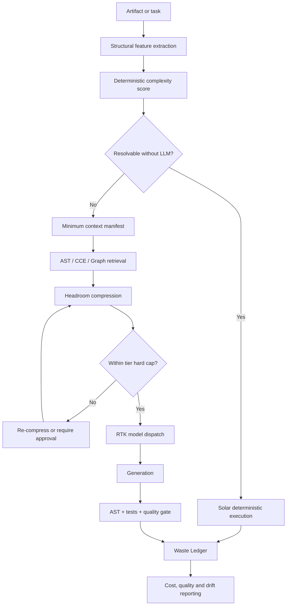

# agent-finops

> **Zero-Waste Context Architecture (ZWCA) Runtime** — deterministic admission, context compression, model routing, token-budget enforcement and auditable Agent FinOps.

`agent-finops` is a local-first plugin and runtime for controlling the cost, context and production readiness of AI agents. It unifies FinOps, context engineering, deterministic harnesses and runtime governance under one operating architecture.

The central contract is simple:

> Every candidate token must pass three gates: **Admission** — does it deserve to enter? **Compression** — can it be smaller? **Audit** — did it generate accepted value?

ZWCA does not promise zero token usage. It targets **zero unjustified or unaccounted token consumption**.

## Why this exists

AI teams usually accumulate four disconnected capabilities:

| Capability | What it solves | Typical gap |
|---|---|---|
| Cost strategy | Model tiers and theoretical savings | No runtime enforcement |
| Context compression | Smaller prompts and retrieval payloads | No production observability |
| Token monitoring | Cost and usage dashboards | Does not control context decisions |
| Engineering harnesses | Deterministic validation and tests | Usually runs only after generation |

`agent-finops` turns those capabilities into one runtime. It decides whether an LLM is needed, builds the smallest defensible context, enforces hard budgets, validates the result and records the economic and quality outcome.

## The four ZWCA planes

```text
┌──────────────────────────────────────────────────────────────┐
│  PLANE 4 — GOVERNANCE & OBSERVABILITY                       │
│  Budget enforcement · Waste Ledger · Drift alerts · FinOps  │
├──────────────────────────────────────────────────────────────┤
│  PLANE 3 — DECISION                                          │
│  Complexity score · Thermal tier · Model routing · Approval  │
├──────────────────────────────────────────────────────────────┤
│  PLANE 2 — CONTEXT                                           │
│  AST admission · CCE retrieval · Graph context · Headroom    │
├──────────────────────────────────────────────────────────────┤
│  PLANE 1 — DETERMINISTIC FLOOR                               │
│  Everything that does not require an LLM executes here       │
└──────────────────────────────────────────────────────────────┘
```

### 1. Deterministic Floor

AST parsing, symbol lookup, exact mappings, renames, one-to-one DDL translations, validation and other deterministic transformations execute without an LLM whenever possible.

This is **token avoidance**, not token compression.

### 2. Context Plane

For tasks that genuinely require a model, the runtime assembles the minimum sufficient context using structural navigation, retrieval, persistent caching and compression.

### 3. Decision Plane

A deterministic `complexity_score` maps each artifact to a Thermal Gradient tier and its associated model class, context budget and approval policy.

**No score, no model call.**

### 4. Governance & Observability

The Guardian enforces hard caps before a provider call. Every decision is recorded in the Waste Ledger, including rejected tokens, transmitted tokens, cost, quality outcome and evidence basis.

## Three runtime gates

### Admission Gate

Determines whether the task:

- can be completed deterministically;
- requires an LLM;
- has a valid complexity score;
- has sufficient structural evidence to proceed.

### Compression Gate

Builds and reduces the context package through:

- AST-aware navigation;
- CCE retrieval;
- dependency and graph filtering;
- cache reuse;
- Headroom compression;
- tier-specific context profiles.

### Audit Gate

Records whether the admitted and transmitted tokens produced accepted value. The audit event includes cost, quality-gate status, model tier, budget compliance and savings evidence.

## Thermal Gradient × RTK dispatch

The initial policy defines six execution tiers:

| Tier | Score | Execution policy |
|---|---:|---|
| **Solar** | 0–15 | Deterministic, zero-token execution |
| **Daylight** | 16–30 | Small model, tightly constrained context |
| **Horizon** | 31–45 | Small or medium model |
| **Twilight** | 46–60 | Reasoning-capable model |
| **Starlight** | 61–80 | Advanced reasoning with approval controls |
| **Aurora** | 81–100 | Frontier model, maximum budget, mandatory approval |

The policy is defined in [`config/zwca-dispatch.yaml`](config/zwca-dispatch.yaml). Initial thresholds and token caps are calibration defaults and must be validated against a representative artifact corpus before production certification.

## Runtime flow



## What is already implemented

- Real token usage ingestion from local transcripts;
- SQLite telemetry and pricing store;
- cost reporting by project, model and period;
- model rightsizing recommendations;
- AST-based code navigation and safe refactoring;
- Headroom context compression integration;
- syntax and test gates before production promotion;
- agent registry with explicit lifecycle;
- self-contained HTML dashboard;
- canonical ZWCA blueprint;
- six-tier dispatch policy;
- Waste Ledger JSON Schema;
- deterministic structural complexity scorer;
- tier-boundary tests;
- unified `/zwca` skill contract.

## Repository anatomy

```text
agent-finops/
├── hooks/                    # tool-call telemetry and runtime interception
├── store/                    # SQLite, transcript ingestion and pricing
├── config/
│   └── zwca-dispatch.yaml    # Thermal Gradient × RTK policy
├── schemas/
│   └── waste-ledger.schema.json
├── scripts/
│   ├── zwca_score.py         # deterministic complexity scoring
│   ├── cost_report.py
│   ├── rightsizing.py
│   ├── gate.py
│   └── sync_registry.py
├── skills/
│   ├── zwca/                 # unified runtime workflow
│   ├── cost-report/
│   ├── rightsizing/
│   ├── compress/
│   ├── code-nav/
│   ├── safe-refactor/
│   ├── agent-gate/
│   └── dashboard/
├── agents/                   # cost analyst, budget guardian, agent auditor
├── dashboard/                # self-contained HTML dashboard generator
├── docs/
│   └── ZWCA_BLUEPRINT.md     # canonical architecture and roadmap
├── tests/                    # scorer and runtime contract tests
└── evals/                    # plugin artifact quality gates
```

## Installation

```bash
claude plugin marketplace add /path/to/agent-finops
claude plugin install agent-finops@agent-finops-marketplace
```

Optional optimization dependencies:

```bash
brew install ast-grep
pipx install headroom-ai
```

Telemetry is stored locally in:

```text
~/.agent-finops/telemetry.db
```

No telemetry is sent to an external service by the plugin.

## Quick start

### 1. Ingest real provider usage

```bash
python3 store/ingest_transcripts.py
```

### 2. Generate a cost report

```bash
python3 scripts/cost_report.py --days 30 --by model
```

### 3. Score an artifact

```bash
python3 scripts/zwca_score.py \
  --ast-nodes 320 \
  --dependency-depth 8 \
  --transform-density 0.72 \
  --branch-density 0.25 \
  --external-systems 3 \
  --unsupported-constructs 1
```

Example output:

```json
{
  "score": 57.4,
  "tier": "twilight",
  "components": {
    "ast_size": 18.2,
    "dependency_depth": 10.0,
    "transform_density": 12.0,
    "branch_density": 7.2,
    "external_systems": 6.0,
    "unsupported_constructs": 4.0
  }
}
```

### 4. Run quality gates

```bash
python3 scripts/gate.py src/*.py
```

### 5. Generate the dashboard

```bash
python3 dashboard/generate_dashboard.py
```

Claude Code skills:

```text
/zwca
/cost-report
/rightsizing
/compress
/code-nav
/safe-refactor
/agent-gate
/dashboard
```

## Waste Ledger

The Waste Ledger is the audit contract for every runtime decision. Its schema is defined in [`schemas/waste-ledger.schema.json`](schemas/waste-ledger.schema.json).

Core fields include:

```json
{
  "artifact_id": "artifact-001",
  "gate": "compression",
  "decision": "admitted",
  "complexity_score": 57.4,
  "tier": "twilight",
  "tokens_candidate": 42000,
  "tokens_admitted": 7300,
  "tokens_transmitted": 6900,
  "tokens_rejected": 35100,
  "cost_usd": 1.84,
  "evidence_basis": "measured",
  "quality_status": "passed"
}
```

Savings evidence is explicitly classified as:

- `measured` — provider usage or tokenizer measurement;
- `estimated` — named estimator or pricing model;
- `counterfactual` — reproducible baseline or A/B cohort.

This prevents estimates from being presented as measured savings.

## Target metrics

| Metric | Target |
|---|---:|
| Deterministic operations | 25–35% |
| Context reduction for LLM cases | ≥80% pilot |
| Blended reduction | 85–90% |
| Structural pass rate | ≥95% |
| Cost per completed artifact | < US$50 |
| Unaccounted token consumption | 0% |

Targets are acceptance criteria, not current production claims. They must be measured against representative workloads and versioned baselines.

## Delivery roadmap

### Phase 0 — Conceptual unification

- validate the dispatch matrix;
- inventory deterministic operations;
- establish the baseline corpus;
- approve the Waste Ledger contract.

### Phase 1 — Deterministic Floor and Context Plane

- platform parsers and structural feature extraction;
- persistent CCE index and cache;
- deterministic admission harness;
- platform-specific compression profiles.

### Phase 2 — Decision Plane and enforcement

- production RTK dispatch;
- Guardian pre-call hard caps;
- re-compress and approval exception paths;
- AST-based output validation;
- controlled A/B evaluation.

### Phase 3 — Scale and institutionalization

- continuous Waste Ledger coverage;
- legacy file-read loop deprecation;
- dashboard and drift alerts;
- shared foundation packaging for AI factories and migration programs.

## Design principles

1. **Deterministic before probabilistic.**
2. **No score, no call.**
3. **Minimum sufficient context.**
4. **Hard caps before provider calls.**
5. **No unlimited retries or automatic frontier escalation.**
6. **Quality and cost are evaluated together.**
7. **Measured, estimated and counterfactual evidence never mix.**
8. **Every admitted token must have an auditable purpose and outcome.**

## Status

The repository is currently at the **ZWCA foundation stage**. Core contracts, dispatch policy and deterministic scoring exist. The next vertical implementation slice is Guardian enforcement: SQLite Waste Ledger migration, pre-call interception, budget evaluation, re-compression fallback and dashboard integration.

## License

Add the project license before external distribution or production adoption.