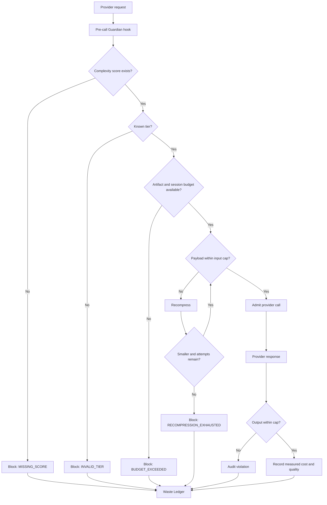

# agent-finops-ZWCA

> **Zero-Waste Context Architecture (ZWCA) Runtime** — deterministic admission, context compression, model routing, token-budget enforcement and auditable Agent FinOps.

`agent-finops` is a local-first runtime for controlling the cost, context and production readiness of AI agents. It unifies FinOps, context engineering, deterministic harnesses and runtime governance under one operating architecture.

> Every candidate token must pass three gates: **Admission** — does it deserve to enter? **Compression** — can it be smaller? **Audit** — did it generate accepted value?

ZWCA does not promise zero token usage. It targets **zero unjustified or unaccounted token consumption**.

## Four planes

```text
┌──────────────────────────────────────────────────────────────┐
│  PLANE 4 — GOVERNANCE & OBSERVABILITY                       │
│  Budget · Waste Ledger · Decision Log · Change History      │
├──────────────────────────────────────────────────────────────┤
│  PLANE 3 — DECISION                                          │
│  Complexity score · Thermal tier · Model routing · Approval  │
├──────────────────────────────────────────────────────────────┤
│  PLANE 2 — CONTEXT                                           │
│  AST admission · CCE retrieval · Graph context · Headroom    │
├──────────────────────────────────────────────────────────────┤
│  PLANE 1 — DETERMINISTIC FLOOR                               │
│  Everything that does not require an LLM executes here       │
└──────────────────────────────────────────────────────────────┘
```

## Runtime contract

1. **Deterministic before probabilistic.**
2. **No score, no call.**
3. **Minimum sufficient context.**
4. **Hard caps before provider calls.**
5. **No unlimited retries or automatic frontier escalation.**
6. **Quality and cost are evaluated together.**
7. **Measured, estimated and counterfactual evidence never mix.**
8. **Every admitted token has an auditable purpose and outcome.**

## Thermal Gradient × RTK tiers

| Tier | Score | Execution policy |
|---|---:|---|
| **Solar** | 0–15 | Deterministic, zero-token execution |
| **Daylight** | 16–30 | Small model, tightly constrained context |
| **Horizon** | 31–45 | Small or medium model |
| **Twilight** | 46–60 | Reasoning-capable model |
| **Starlight** | 61–80 | Advanced reasoning with approval controls |
| **Aurora** | 81–100 | Frontier model, maximum budget, mandatory approval |

The canonical policy is defined in [`config/zwca-dispatch.yaml`](config/zwca-dispatch.yaml).

## Guardian Enforcement Vertical

The Guardian slice moves ZWCA from architecture contracts into active runtime enforcement.

### Implemented

- SQLite migration for `zwca_sessions` and `waste_ledger_events`;
- mandatory pre-call interception;
- `no score, no call` enforcement;
- tier input and output hard caps;
- artifact and session budget evaluation;
- bounded recompression loop;
- fail-closed behavior when recompression makes no progress;
- admission, compression and audit event emission;
- measured completion cost persisted into session and artifact spend;
- automated tests for the main allow/block paths.

### Runtime flow



## Repository anatomy

```text
agent-finops/
├── runtime/                     # CORE — standalone Python, no Claude Code dependency
│   └── guardian.py              # enforcement engine
├── hooks/                       # CORE
│   └── pre_call_guardian.py     # stdin/stdout provider-call interceptor
├── store/                       # CORE
│   ├── waste_ledger.py          # persistence repository
│   ├── decision_log.py          # Memory bucket — decisions, not documentation
│   ├── change_history.py        # Change History bucket — artifact deltas, not rewrites
│   └── migrations/
│       ├── 002_waste_ledger.sql
│       ├── 004_decision_log.sql
│       └── 005_change_history.sql
├── config/                      # CORE
│   └── zwca-dispatch.yaml       # Thermal Gradient × RTK policy
├── schemas/                     # CORE
│   ├── waste-ledger.schema.json
│   ├── decision-log.schema.json
│   └── change-history.schema.json
├── scripts/                     # CORE, except zwca_score.py (project-specific)
│   ├── zwca_score.py            # complexity scoring — rewrite per project, see docs/EXTENDING.md
│   ├── cost_report.py
│   ├── rightsizing.py
│   └── gate.py
├── .claude-plugin/               # PLUGIN — Claude Code packaging over the core
├── agents/                       # PLUGIN
├── skills/                       # PLUGIN
│   ├── zwca/
│   ├── compress/
│   ├── code-nav/
│   ├── safe-refactor/
│   └── agent-gate/
├── dashboard/                    # CORE
├── docs/
│   ├── ZWCA_BLUEPRINT.md
│   └── EXTENDING.md              # how to port the core into a new project
├── CHANGELOG.md
└── tests/
    ├── test_zwca_score.py
    ├── test_guardian.py
    ├── test_decision_log.py
    └── test_change_history.py
```

`runtime/`, `hooks/`, `store/`, `config/`, `schemas/`, `scripts/` (minus
`zwca_score.py`) and `dashboard/` are the **core**: plain Python, installable
and runnable without Claude Code. `.claude-plugin/`, `agents/` and `skills/`
are the **plugin layer** that packages the core for Claude Code specifically.
See [Installation](#installation) for both paths, and
[`docs/EXTENDING.md`](docs/EXTENDING.md) for porting the core into a
different project.

## Pre-call hook contract

The interceptor reads one JSON object from `stdin` and writes an allow/block decision to `stdout`.

```json
{
  "session_id": "session-001",
  "project_id": "migration-factory",
  "artifact_id": "ssis-package-042",
  "payload": "minimum context package",
  "candidate_tokens": 8200,
  "complexity_score": 34.2,
  "tier": "horizon",
  "provider": "azure-openai",
  "model": "small-reasoning-model",
  "estimated_cost_usd": 0.42,
  "artifact_budget_usd": 10.0,
  "session_budget_usd": 100.0
}
```

Run it locally:

```bash
export AGENT_FINOPS_DB=~/.agent-finops/telemetry.db
cat request.json | python3 hooks/pre_call_guardian.py
```

Allowed response:

```json
{
  "allow": true,
  "payload": "compressed context package",
  "tier": "horizon",
  "admitted_tokens": 7900,
  "rejected_tokens": 300,
  "recompress_attempt": 1
}
```

Blocked response:

```json
{
  "allow": false,
  "reason": "no score, no call"
}
```

The hook exits with code `0` when admitted and `2` when blocked.

## Waste Ledger

The SQLite migration creates:

- `zwca_sessions` — project, session budget and accumulated measured spend;
- `waste_ledger_events` — gate decisions, token movement, budget state, recompression attempts, quality and cost evidence.

Events use explicit reason codes such as:

- `MISSING_SCORE`;
- `INVALID_TIER`;
- `ARTIFACT_BUDGET_EXCEEDED`;
- `SESSION_BUDGET_EXCEEDED`;
- `TIER_INPUT_CAP_EXCEEDED`;
- `RECOMPRESSION_NO_PROGRESS`;
- `RECOMPRESSION_EXHAUSTED`;
- `TIER_OUTPUT_CAP_EXCEEDED`;
- `CALL_COMPLETED`.

Savings evidence remains separated into `measured`, `estimated` and `counterfactual`.

## Memory and Change History

Two buckets sit alongside the Waste Ledger for the parts of a workload that
aren't token spend: decisions and artifact evolution.

**Decision Log** (`store/decision_log.py`, `zwca_decisions` table) is memory,
not documentation — a durable record of what was decided and why, not a
document that describes it. Recording a decision with `supersedes_decision_id`
automatically closes the prior decision out, so `current()` always reflects
only the decisions still in force for a project.

```python
from store.decision_log import Decision, DecisionLog

log = DecisionLog("~/.agent-finops/telemetry.db")
log.migrate()
log.record(Decision(
    project_id="allianz",
    decision="Use Fabric Warehouse",
    reason="Lower operating cost",
    decided_by="architecture-board",
))
```

**Change History** (`store/change_history.py`, `zwca_artifact_changes` table)
records how artifacts (assessments, ROMs, ADRs) evolve as patches, not
snapshots: each entry is a delta between two versions, not the artifact
rewritten in full. Every entry declares an `evidence_basis`
(`measured`/`estimated`/`counterfactual`), the same discipline the Waste
Ledger applies to savings claims, so "the ROM grew 20%" is always traceable
to what actually changed instead of guessed after the fact.

```python
from store.change_history import ArtifactChange, ChangeHistory

history = ChangeHistory("~/.agent-finops/telemetry.db")
history.migrate()
history.record(ArtifactChange(
    project_id="allianz",
    artifact_id="rom-1",
    artifact_type="rom",
    from_version="1.0",
    to_version="1.1",
    change_summary="added SAP dependency, automation coverage dropped 80% -> 55%",
    affected_objects=["Z_SALES_REPORT"],
    evidence_basis="measured",
))
```

Both tables live in the same local SQLite store as the Waste Ledger
(`~/.agent-finops/telemetry.db` by default) and follow the same enforcement
posture: no unvalidated status values (`Decision.status`,
`ArtifactChange.evidence_basis` reject anything outside their enum), and
schemas published at `schemas/decision-log.schema.json` and
`schemas/change-history.schema.json`.

## Installation

The distribution technology is a **Claude Code plugin**, but the enforcement
engine underneath (`runtime/`, `store/`, `hooks/`) is a standalone Python
core with no dependency on Claude Code. Pick the path that matches your
consumer.

### Required core dependency

`runtime/compressors.py` calls Headroom directly, and the Guardian
enforcement path depends on it — this is **not optional**, install it
before anything else:

```bash
pipx install headroom-ai
```

`brew install ast-grep` is optional and only needed for `scripts/gate.py`'s
TypeScript/TSX syntax validation path.

### Path A — as a Claude Code plugin

```bash
claude plugin marketplace add /path/to/agent-finops
claude plugin install agent-finops@agent-finops-marketplace
```

This wires up `agents/` and `skills/` so Claude Code can call the core
through `${CLAUDE_PLUGIN_ROOT}`.

### Path B — as a standalone Python runtime

For non-Claude-Code consumers (another agent framework, a CI job, a plain
service), install the core directly and drive it via the scripts and hooks
under `runtime/`, `store/`, `hooks/` and `scripts/`:

```bash
python3 -m venv .venv && source .venv/bin/activate
pip install -r requirements-pilot.txt   # includes headroom-ai, openai, anthropic
```

`hooks/pre_call_guardian.py` reads one JSON request from stdin and writes an
allow/block decision to stdout — see [Pre-call hook contract](#pre-call-hook-contract).
No Claude Code process is required for this path. See
[`docs/EXTENDING.md`](docs/EXTENDING.md) for what's reusable as-is versus
what needs to be rewritten per project.

Telemetry stays local by default in both paths:

```text
~/.agent-finops/telemetry.db
```

## Quick start

```bash
python3 store/ingest_transcripts.py
python3 scripts/cost_report.py --days 30 --by model
python3 scripts/zwca_score.py --ast-nodes 320 --dependency-depth 8 \
  --transform-density 0.72 --branch-density 0.25 \
  --external-systems 3 --unsupported-constructs 1
python3 -m pytest tests/test_zwca_score.py tests/test_guardian.py
python3 dashboard/generate_dashboard.py
```

## Target metrics

| Metric | Target |
|---|---:|
| Deterministic operations | 25–35% |
| Context reduction for LLM cases | ≥80% pilot |
| Blended reduction | 85–90% |
| Structural pass rate | ≥95% |
| Cost per completed artifact | < US$50 |
| Unaccounted token consumption | 0% |

These are acceptance criteria, not current production claims. They were
calibrated against this repository's original legacy data-migration pilot
(Informatica/DataStage/SSIS artifacts) — a different project should re-run
its own Phase 0 baseline before adopting these numbers as targets. See
[Extending to a new project](#extending-to-a-new-project).

## Current status

The repository now includes the **Guardian Enforcement Vertical** foundation. The runtime can persist gate events, block invalid calls, enforce artifact/session budgets, recompress oversized input and audit measured completion cost.

## Extending to a new project

The core (`runtime/`, `store/`, `hooks/`, most of `scripts/`, `dashboard/`)
is domain-agnostic and portable as-is. `scripts/zwca_score.py` and the
migration-specific entries in `config/zwca-dispatch.yaml`'s
`platform_profiles` are not — they encode structural features and
compression strategies for the original pilot's artifact types.

[`docs/EXTENDING.md`](docs/EXTENDING.md) documents exactly what's reusable
versus what to rewrite, and proposes a package split
(`agent-finops-core` + per-project extension point) for when the core is
extracted for reuse across multiple projects.

## Versioning

This project follows [Semantic Versioning](https://semver.org/); the
version tracked in `.claude-plugin/plugin.json` is the source of truth.
See [`CHANGELOG.md`](CHANGELOG.md) for release notes. Changes to
`runtime/guardian.py`'s enforcement contract or the Waste Ledger schema are
breaking changes for downstream consumers — pin to a tag/commit if you
vendor these components into another project.

## License

MIT — see [LICENSE](LICENSE).
