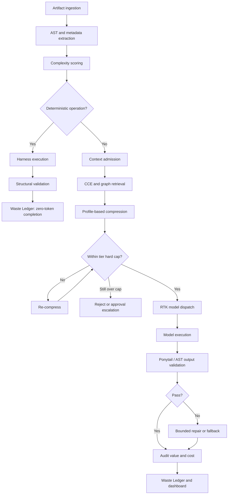

# Zero-Waste Context Architecture (ZWCA)

> Canonical architecture for turning `agent-finops` from a cost dashboard into an enforceable context-efficiency runtime.

## Decision

ZWCA is **not a fifth framework**. It is the operating contract that unifies the existing capabilities already represented in this repository and its related engineering assets:

- Thermal Gradient: economic tiers and model-cost strategy.
- RTK: deterministic task dispatch and model routing.
- CCE / Headroom: context selection and compression.
- Token Guardian / AI Cost Optimizer: runtime interception, budgets and telemetry.
- DPABB Engineering Harnesses: deterministic execution and structural validation.

The central invariant is:

> Every candidate token must pass three gates: Admission, Compression and Audit.

A token that fails a gate is rejected, measured and recorded. A task that can be completed deterministically never enters the LLM path.

## Four planes

### Plane 1 — Deterministic Floor

Executes operations that do not require probabilistic reasoning:

- type mappings;
- exact renames;
- one-to-one DDL translations;
- schema normalization;
- syntax parsing;
- AST-based structural transformations;
- policy checks and output validation.

This plane is the first admission filter. Its principal KPI is `deterministic_avoidance_rate`.

### Plane 2 — Context Plane

Builds the smallest sufficient context package:

1. AST extraction;
2. structural admission;
3. symbol/dependency resolution;
4. CCE retrieval using lexical and semantic indexes;
5. graph expansion within a bounded depth;
6. platform-specific Headroom compression;
7. persistent cache lookup/write.

This plane must produce a `context_manifest` describing every admitted context unit and why it was included.

### Plane 3 — Decision Plane

Combines Thermal Gradient tiers with RTK routing.

Every artifact receives a deterministic `complexity_score` before any model call. The score is computed from structural evidence such as:

- AST node count;
- dependency depth;
- transformation density;
- branching/cyclomatic indicators;
- number of external systems;
- ambiguity and unsupported construct penalties.

The score selects a tier, budget cap, model class and fallback policy. **No score, no call.**

### Plane 4 — Governance and Observability

Token Guardian becomes an enforcement point rather than a reporting surface:

- hard budget caps per artifact and tier;
- pre-call policy evaluation;
- re-compression fallback;
- explicit escalation for exceptions;
- post-call value accounting;
- drift alerts;
- immutable Waste Ledger events;
- Decision Log — durable record of decisions and why they were made, distinct
  from documentation and closed out automatically when superseded
  (`store/decision_log.py`);
- Change History — artifacts evolve through patches, not rewrites; every
  delta declares `measured`/`estimated`/`counterfactual` evidence, so a
  question like "why did the ROM grow 20%?" is answerable from the ledger
  instead of reconstructed from memory (`store/change_history.py`).

## Three gates

### Gate A — Admission

Question: **Does this task or context unit deserve to enter the probabilistic path?**

Possible outcomes:

- `deterministic`: execute on Plane 1, zero model tokens;
- `admit`: continue to context construction;
- `reject`: insufficient relevance, unsupported or duplicate;
- `escalate`: policy requires approval.

### Gate B — Compression

Question: **Can admitted context be represented more compactly without losing required semantics?**

Compression is profile-based. SQL, Informatica XML, DataStage exports and SSIS packages must not share a single threshold because their structural redundancy differs.

### Gate C — Audit

Question: **Did admitted tokens generate measurable value?**

Audit compares:

- candidate vs admitted vs transmitted tokens;
- generated output accepted vs rejected by structural gates;
- cost per artifact;
- pass rate;
- retries and fallback path;
- cache reuse;
- tokens admitted but unused or associated with failed output.

## Dispatch contract

The canonical dispatch configuration lives in `config/zwca-dispatch.yaml`.

Each tier defines:

- score range;
- execution mode;
- maximum input/output tokens;
- model class;
- compression target;
- retry count;
- exception behavior.

Tier names preserve the Thermal Gradient metaphor while assigning precise runtime semantics.

## Waste Ledger

The canonical event schema lives in `schemas/waste-ledger.schema.json`.

The ledger records both avoided and consumed work. Avoided tokens are not hypothetical savings unless a reproducible candidate-token estimate exists. The implementation must distinguish:

- `measured`: derived from provider usage or tokenizer output;
- `estimated`: derived from a declared estimator;
- `counterfactual`: baseline comparison from an A/B cohort.

The same three-way distinction applies to Change History
(`schemas/change-history.schema.json`) — a claim that an artifact grew or
shrank must say which of the three it is, exactly like a token-savings claim.
Decisions (`schemas/decision-log.schema.json`) don't carry an evidence basis
of their own; they are the reason a change or a cost was incurred, not a
savings claim.

This prevents inflated savings claims.

## Runtime flow

## Success metrics

| Metric | Initial target | Definition |
|---|---:|---|
| Deterministic avoidance | >=25% | operations completed without an LLM / eligible operations |
| LLM context reduction | >=80% pilot; 85–90% blended target | 1 - transmitted tokens / reproducible baseline tokens |
| Structural pass rate | >=95% | outputs accepted by syntax, AST and test gates |
| Cost per artifact | < US$50 | provider cost allocated to successfully processed artifact |
| Budget violations | 0 unapproved | calls exceeding hard cap without an approved exception |
| Ledger completeness | 100% | artifacts with complete admission, dispatch and audit events |

The target is not literally zero tokens. It is zero **unaccounted and unjustified** token consumption.

## Delivery plan

### Phase 0 — Contract and baseline

- approve dispatch matrix;
- inventory deterministic operations;
- establish baseline cohort;
- validate ledger definitions.

Exit: measured deterministic baseline and approved tier policy.

### Phase 1 — Deterministic and Context planes

- parsers/adapters for Informatica XML, DataStage and SSIS;
- complexity feature extraction;
- deterministic admission rules;
- CCE persistent index and cache;
- platform compression profiles.

Exit: 50-artifact pilot, >=25% deterministic operations and >=80% context reduction for LLM cases.

### Phase 2 — Decision and enforcement

- production scorer;
- tier dispatch;
- hard-cap enforcement;
- bounded re-compression and exception workflow;
- AST/Ponytail validation.

Exit: A/B cohort of 100 artifacts, >=85% blended reduction, <US$50/artifact and >=95% pass rate.

### Phase 3 — Scale and institutionalization

- rollout to 545 artifacts;
- remove legacy file-read loops;
- publish plugin skills and governance guideline v2;
- integrate as the shared AI Factory foundation layer.

## Naming

Keep `agent-finops` as the repository and distribution identity for compatibility. Use **ZWCA Runtime** as the architecture name until product branding is decided. A brand such as “Orange DNA” can be introduced later as a presentation layer without contaminating schemas, APIs or package names.
